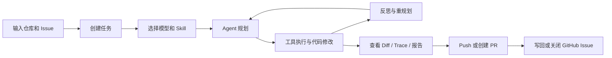

# GitAssisstant

<p align="center">
  <strong>面向 GitHub Issue 的自动化代码修复 Agent 工作台</strong>
</p>

<p align="center">
  <a href="https://www.python.org/"></a>
  <a href="https://fastapi.tiangolo.com/"></a>
  <a href="https://react.dev/"></a>
  <a href="https://vite.dev/"></a>
</p>

GitAssisstant 是一个把 GitHub Issue、代码仓库、LLM Agent、Skill 路由、代码 Diff、修复报告和 PR 发布串在一起的本地开发工作台。它不是单纯的聊天界面，而是围绕“给定一个仓库和一个 Issue，让 Agent 在隔离/本地执行环境中分析、修改、追踪并交付结果”的完整工作流。

项目内部包名保留为 `gitIssueAssitant`，这是当前代码中的实际模块名。

## 项目链接

- 迭代二镜像仓库：`https://git.nju.edu.cn/2026seiii/2026seiii-045-1145`
- 评估平台：`http://8.160.182.149/`

## 核心能力

- Issue 驱动：输入本地仓库路径或 GitHub 仓库地址，再输入 Issue 编号、链接或完整描述来创建任务。
- Web 控制台：通过 React 页面管理任务、查看状态、继续补充要求、刷新 Diff、查看报告和 Trace。
- Agent 编排：后端基于 LangGraph 组织 `planner -> react -> tools -> reflect` 的执行流。
- Skill 路由：内置 Skill 可按任务选择性暴露给 Agent，支持在任务说明中通过 `$` 触发。
- GitHub 集成：可浏览仓库 Issues、写回 Issue 评论、关闭 Issue、提交并 Push、创建 Pull Request。
- 过程追踪：记录 Agent 运行事件、工具调用、失败原因、建议修复和最终报告。
- 双入口：提供 Web 工作台，也保留交互式 CLI。

## 工作流



## 技术栈

| 层级 | 技术 |
| --- | --- |
| 后端 | Python 3.11+, FastAPI, Uvicorn, Pydantic |
| Agent | LangChain Core, LangGraph, OpenAI SDK |
| 前端 | React 18, TypeScript, Vite |
| 工程能力 | Git 工具封装、GitHub Issue/PR 集成、任务状态持久化、Trace/Report 输出 |

## 项目结构

```text
.
├── start.ps1                       # Windows 一键启动脚本
├── start.bat                       # start.ps1 的批处理入口
├── agent/
│   ├── pyproject.toml              # Python 后端与 Agent 依赖
│   ├── gitIssueAssitant/
│   │   ├── RESTAPIAdapter/         # FastAPI 适配层
│   │   ├── CLI/                    # 交互式命令行入口
│   │   └── core/
│   │       ├── agent/              # Agent、编排器、工具、Skill
│   │       ├── services/           # 任务、设置、GitHub、长期记忆等服务
│   │       ├── schemas/            # API 数据结构
│   │       └── repositories/       # 本地持久化访问
│   └── frontend/
│       ├── src/                    # React 控制台
│       └── package.json
```

## 快速开始

### 1. 安装后端依赖

```powershell
cd agent
python -m venv .venv
.\.venv\Scripts\activate
pip install -e .
```

### 2. 安装前端依赖

```powershell
cd agent\frontend
npm install
```

### 3. 配置环境变量

可以在 Web 控制台的“设置”中写入配置，也可以手动创建 `agent/.env`：

```env
OPENAI_API_KEY="your-api-key"
OPENAI_BASE_URL="https://api.openai.com/v1"
MODEL_NAME="your-model-name"
GITHUB_TOKEN="your-github-token"
GIT_ISSUE_ASSISTANT_CLONE_ROOT="repos"
```

说明：

- `OPENAI_API_KEY`：必填，用于调用模型。
- `OPENAI_BASE_URL`：可选，默认使用 OpenAI 官方接口地址。
- `MODEL_NAME`：建议填写，Web 任务会默认使用该模型。
- `GITHUB_TOKEN`：需要浏览 Issue、写评论、关闭 Issue、Push 或创建 PR 时填写。
- `GIT_ISSUE_ASSISTANT_CLONE_ROOT`：远程仓库克隆目录，默认是 `agent/repos`。

### 4. 一键启动

在项目根目录执行：

```powershell
.\start.ps1
```

启动后访问：

- Web 控制台：`http://127.0.0.1:5173`
- 后端接口：`http://127.0.0.1:8000`
- API 文档：`http://127.0.0.1:8000/docs`

### 5. 手动启动

后端：

```powershell
cd agent
.\.venv\Scripts\activate
uvicorn gitIssueAssitant.RESTAPIAdapter.main:app --reload --reload-dir gitIssueAssitant --port 8000
```

前端：

```powershell
cd agent\frontend
npm run dev
```

## CLI 用法

```powershell
cd agent
.\.venv\Scripts\activate
python -m gitIssueAssitant
```

常用命令：

```text
/repo <git_url|local_path> [target_dir]  创建或切换仓库会话
/issue <desc|#number|url>                设置 Issue
/solve [-v|--verbose]                    自动分析并尝试修复
/status                                  查看当前状态
/sessions                                查看会话
/help                                    查看帮助
```

## Web 工作台使用路径

1. 在“设置”中填写模型、API Key、GitHub Token 和克隆目录。
2. 在“新任务”中填写仓库路径或 Git URL。
3. 输入 Issue 编号、链接或完整问题描述。
4. 选择需要暴露给 Agent 的 Skill。
5. 创建任务并等待 Agent 执行。
6. 在任务详情页查看对话、工具调用、沙箱/本地执行状态、Diff、Trace 和修复报告。
7. 确认变更后执行 Push 或创建 Pull Request。
8. 需要时向 GitHub Issue 写回评论或关闭 Issue。

## 运行时说明

- 后端默认监听 `8000`，前端默认监听 `5173`。
- `start.ps1` 会把后端日志写入 `backend.log`，前端日志写入 `frontend.log`。
- 后端 reload 只监听 `gitIssueAssitant` 目录，避免 Agent 修改 `repos/` 下目标仓库时反复触发后端重启。
- Web 端执行任务时，Agent 的直接 `git_add`、`git_commit`、`git_push` 工具会被禁用；提交、Push 和 PR 创建由任务详情页的显式按钮触发。

## 适合场景

- 课程项目中的 GitHub Issue 自动修复演示。
- 本地代码 Agent 原型验证。
- 对比不同模型、Skill 或任务策略下的修复过程。
- 需要完整记录 Agent 执行轨迹、工具调用、报告和最终代码变更的实验。

## 注意事项

- Agent 会读取并修改目标仓库代码，请优先在可回滚的分支或测试仓库中运行。
- Push、PR、Issue 评论和关闭 Issue 都依赖有效的 `GITHUB_TOKEN`。
- 如果使用远程仓库，确认本机 Git 凭证和 GitHub Token 权限满足操作需求。
- 当前 README 按现有代码能力整理，具体行为以仓库当前实现为准。
