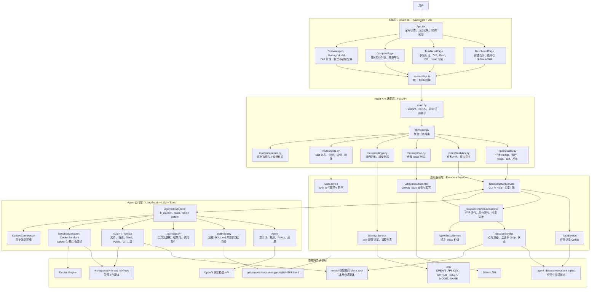
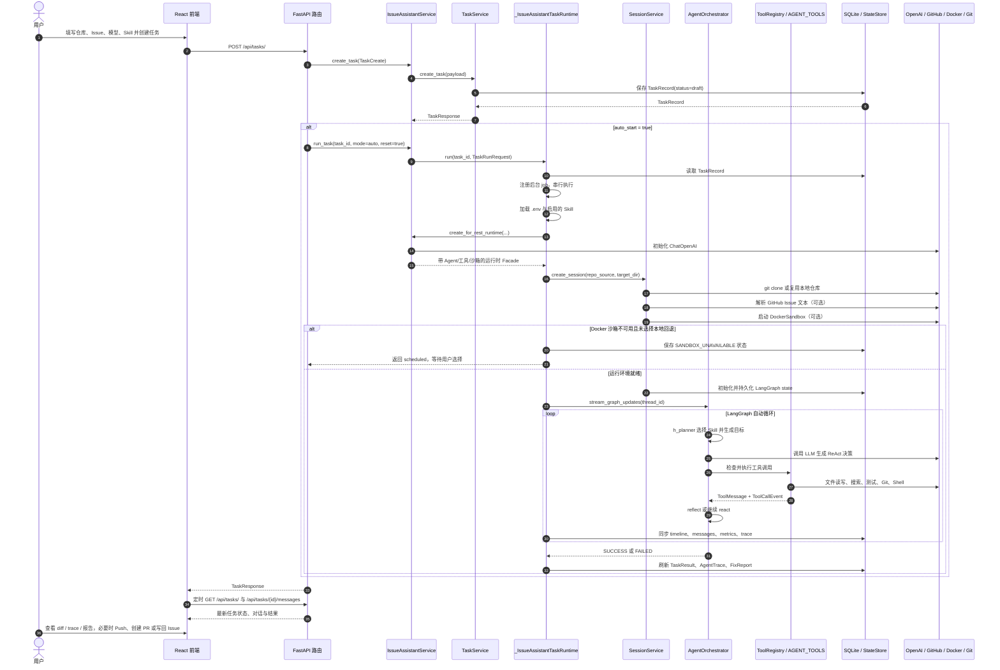
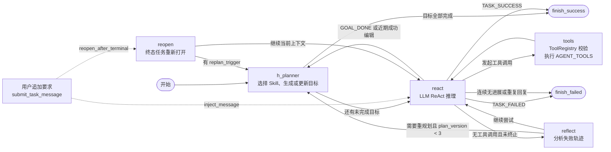
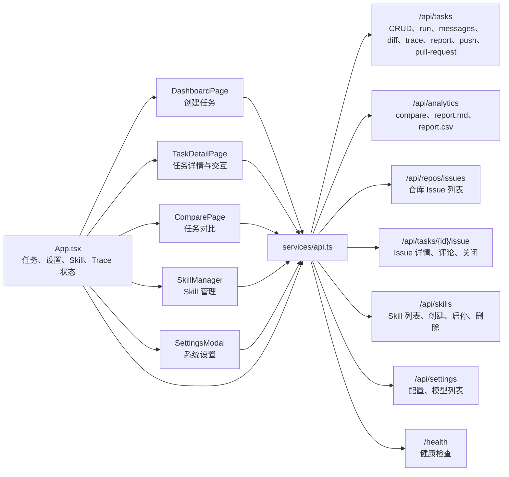
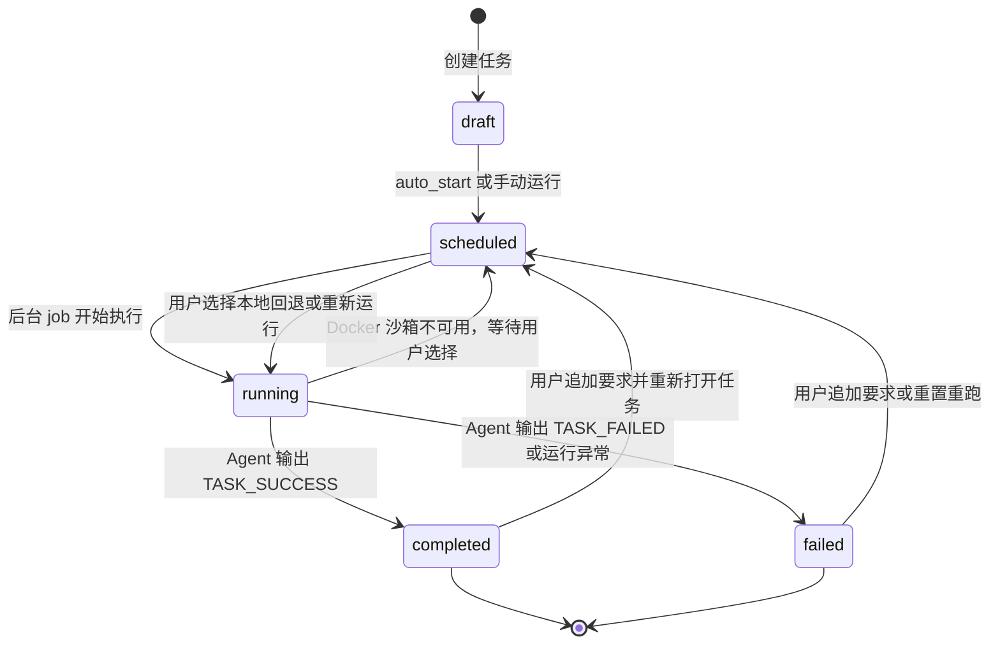

# GitIssueAssitant 系统设计图

本文档用于补充项目设计说明，覆盖系统框架图、任务执行流程图、Agent 内部流程图和核心 UML 类图。图表采用 Mermaid 编写，可直接在 GitHub、VS Code Mermaid 插件或支持 Mermaid 的 Markdown 预览器中查看。

## 1. 系统框架图

### 分层说明

| 层级 | 主要职责 | 关键文件 |
| --- | --- | --- |
| 前端层 | 创建任务、展示执行过程、提交补充指令、查看 diff/trace、发起 Push/PR/Issue 写回 | `frontend/src/App.tsx`, `frontend/src/pages/*`, `frontend/src/services/api.ts` |
| REST API 适配层 | 将 HTTP 请求转发到核心服务，统一响应模型和错误码 | `gitIssueAssitant/RESTAPIAdapter/main.py`, `api/routes/*.py` |
| 应用服务层 | 任务生命周期、运行时构建、结果同步、Trace、配置、Skill、GitHub Issue | `gitIssueAssitant/core/services/*` |
| Agent 运行层 | LLM 规划、ReAct 推理、工具执行、安全拦截、沙箱执行、上下文压缩 | `gitIssueAssitant/core/agent/*` |
| 数据与外部依赖 | SQLite 持久化、`.env` 配置、Skill 文件、本地仓库、Docker、GitHub、模型 API | `.agent_data`, `.env`, `repos`, `workspaces` |

## 2. 系统流程图：任务创建与自动执行

## 3. Agent 内部状态流图

## 4. UML 类图：核心后端与 Agent 运行时

```mermaid
classDiagram
    class IssueAssistantService {
        +Path workspace_root
        +AgentOrchestrator orchestrator
        +SessionService session_service
        +SandboxManager sandbox_manager
        +create_for_adapter(workspace_root)
        +create_for_rest_runtime(workspace_root, enabled_skill_names, sandbox_manager, model_name)
        +list_tasks()
        +create_task(payload)
        +run_task(task_id, request)
        +submit_task_message(task_id, payload)
        +get_task_trace(task_id)
        +get_task_git_diff(task_id)
        +push_task_changes(task_id, request)
        +create_task_pull_request(task_id, request)
    }

    class IssueAssistantTaskRuntime {
        <<runtime>>
        +dict runtime_handles
        +dict background_jobs
        +run(task_id, request)
        +submit_message(task_id, payload)
        +get_result(task_id)
        +get_trace(task_id)
        +get_git_diff(task_id)
        +push_changes(task_id, request)
        +create_pull_request(task_id, request)
        -_ensure_runtime(task, reset, allow_local_fallback)
        -_run_graph(task, handle, mode)
        -_sync_state(task, state)
    }

    class TaskService {
        +list_tasks()
        +get_task(task_id)
        +create_task(payload)
        +update_task(task_id, payload)
        +delete_task(task_id)
        +get_task_record(task_id)
        +save_task_record(task)
    }

    class TaskRepository {
        +Path db_path
        +list()
        +get(task_id)
        +save(task)
        +delete(task_id)
        -_serialize_task(task)
        -_deserialize_task(payload)
    }

    class TaskRecord {
        +str id
        +str name
        +str description
        +TaskStatus status
        +TaskConfig config
        +TaskResult result
        +str thread_id
        +str repo_path
    }

    class TaskConfig {
        +str repo_source
        +str issue_input
        +str target_dir
        +str model_name
        +RunMode run_mode
        +list enabled_skills
    }

    class TaskResult {
        +str task_id
        +str summary
        +ExecutionOutcome outcome
        +list metrics
        +list timeline
        +list messages
        +RuntimeSnapshot current_state
        +AgentTrace agent_trace
        +FixReport fix_report
    }

    class RuntimeSnapshot {
        +str thread_id
        +str repo_path
        +str sandbox_id
        +str status
        +int iteration_count
        +list plan
        +str selected_skill
    }

    class AgentTrace {
        +str trace_id
        +str task_id
        +str conversation_id
        +str status
        +dict token_usage
        +list events
    }

    class SessionService {
        +AgentOrchestrator orchestrator
        +Path workspace_root
        +Path repos_root
        +dict sessions
        +create_session(repo_ref, target_dir, force)
        +switch_session_by_thread_id(thread_id)
        +set_issue(issue_desc, issue_description)
        +get_current_thread_id()
        +get_current_state()
        +persist_thread_state(thread_id, last_node)
        +cleanup_current_session()
    }

    class SessionStateRepository {
        +list_sessions()
        +save_session(session)
        +save_state(session_id, thread_id, state, last_node)
        +load_state_record(thread_id)
    }

    class Session {
        +str session_id
        +str thread_id
        +str repo_path
        +str issue_ref
        +str issue_description
        +str sandbox_error
    }

    class AgentOrchestrator {
        +Agent agent
        +list tools
        +StateGraph graph
        +ToolRegistry registry
        +SandboxManager sandbox_manager
        +stream_graph_updates(thread_id)
        +inject_message(thread_id, content, replan)
        +reopen_after_terminal(thread_id)
        +persist_state(thread_id, last_node)
        -_node_h_planner(state)
        -_node_react(state)
        -_node_tools(state)
        -_node_reflect(state)
        -_route_react(state)
    }

    class Agent {
        +ChatOpenAI llm
        +list tools
        +dict last_token_usage
        +set_tools(tools)
        +select_skill_and_plan(issue_description, skills_catalog)
        +generate_hierarchical_plan(issue_description)
        +run_react(messages, issue_description, repo_path)
        +reflect_on_failure(trajectory)
        +verify_issue_resolved(issue_description, diff_output)
    }

    class ToolRegistry {
        +register_all(tools)
        +hard_disable(name)
        +check_invocation(tool_name, tool_args)
        +record_event(event)
        +get_tool(name)
        +get_meta(name)
        +get_all_meta()
    }

    class ToolMeta {
        +str name
        +str description
        +ToolCategory category
        +RiskLevel risk_level
        +bool requires_confirmation
        +bool sandbox_routed
    }

    class ToolCallEvent {
        +str tool_name
        +dict arguments
        +str status
        +str result_preview
        +str error_message
        +int latency_ms
        +str sandbox_id
        +list affected_files
        +int exit_code
        +to_dict()
    }

    class SkillRegistry {
        +Path skills_dir
        +dict skills
        +load()
        +list_skills()
        +get(name)
        +router_catalog()
    }

    class SkillService {
        +list_skills()
        +default_enabled_names()
        +set_enabled(name, enabled)
        +create_skill(payload)
        +delete_skill(name)
    }

    class SettingsService {
        +get_settings()
        +update_settings(payload)
        +list_models()
    }

    class GitHubIssueService {
        +list_issues(owner, repo, state, per_page)
        +get_issue(task_id, include_comments)
        +create_comment(task_id, payload)
        +update_state(task_id, payload)
    }

    class AgentTraceService {
        +build_trace(task, result, state)
    }

    class SandboxManager {
        +Path workspace_root
        +dict sandboxes
        +get_or_create(thread_id, repo_path)
        +get(thread_id)
        +stop(thread_id)
        +stop_all()
        +cleanup(thread_id)
    }

    class DockerSandbox {
        +str task_id
        +Path repo_path
        +Path host_work_dir
        +str container_name
        +start()
        +stop()
        +cleanup()
    }

    IssueAssistantService --> TaskService : delegates CRUD
    IssueAssistantService --> IssueAssistantTaskRuntime : lazy task runtime
    IssueAssistantService --> AgentOrchestrator : runtime facade owns
    IssueAssistantService --> SessionService : runtime facade owns
    IssueAssistantService --> SandboxManager : optional

    IssueAssistantTaskRuntime --> TaskService : read and save TaskRecord
    IssueAssistantTaskRuntime --> IssueAssistantService : creates per-task runtime
    IssueAssistantTaskRuntime --> AgentTraceService : refresh trace

    TaskService --> TaskRepository : persists through
    TaskRepository --> TaskRecord : serializes
    TaskRecord *-- TaskConfig
    TaskRecord o-- TaskResult
    TaskResult o-- RuntimeSnapshot
    TaskResult o-- AgentTrace

    SessionService --> SessionStateRepository : persists session and graph state
    SessionService o-- Session
    SessionService --> SandboxManager : starts sandbox

    AgentOrchestrator --> Agent : invokes LLM
    AgentOrchestrator --> ToolRegistry : checks tool calls
    AgentOrchestrator --> SkillRegistry : loads routing catalog
    AgentOrchestrator --> SandboxManager : activates sandbox
    ToolRegistry o-- ToolMeta
    ToolRegistry o-- ToolCallEvent

    SkillService --> SkillRegistry : reads and writes Skill files
    GitHubIssueService --> TaskService : resolves task issue
    SandboxManager o-- DockerSandbox
```

## 5. 前端页面与接口关系

## 6. 关键状态流转

## 7. 主要接口清单

| 模块 | 接口 | 用途 |
| --- | --- | --- |
| 健康检查 | `GET /health` | 前端判断后端是否在线 |
| 任务 | `GET /api/tasks/` | 获取任务列表 |
| 任务 | `POST /api/tasks/` | 创建任务，可自动启动 |
| 任务 | `POST /api/tasks/{task_id}/run` | 运行、重跑或本地回退执行任务 |
| 任务 | `GET/POST /api/tasks/{task_id}/messages` | 获取对话、提交补充要求 |
| 任务 | `GET /api/tasks/{task_id}/diff` | 获取本地仓库变更 |
| 任务 | `GET /api/tasks/{task_id}/trace` | 获取标准 AgentTrace |
| 任务 | `GET /api/tasks/{task_id}/report` | 下载修复报告 |
| 发布 | `POST /api/tasks/{task_id}/push` | 提交并推送任务变更 |
| 发布 | `POST /api/tasks/{task_id}/pull-request` | 创建 Pull Request |
| GitHub Issue | `GET /api/repos/issues` | 浏览仓库 Issues |
| GitHub Issue | `GET /api/tasks/{task_id}/issue` | 获取任务关联 Issue |
| GitHub Issue | `POST /api/tasks/{task_id}/issue/comment` | 写回 Issue 评论 |
| GitHub Issue | `PATCH /api/tasks/{task_id}/issue/state` | 关闭 Issue |
| 评测对比 | `GET /api/analytics/compare` | 对比多个任务指标 |
| 评测对比 | `GET /api/analytics/report.md` / `report.csv` | 导出对比报告 |
| Skill | `GET/POST /api/skills/` | 查看或创建 Skill |
| Skill | `PUT /api/skills/{name}/enabled` | 启用或禁用 Skill |
| 设置 | `GET/PUT /api/settings/` | 读取或更新 `.env` 配置 |
| 设置 | `GET /api/settings/models` | 从模型 API 拉取模型列表 |
