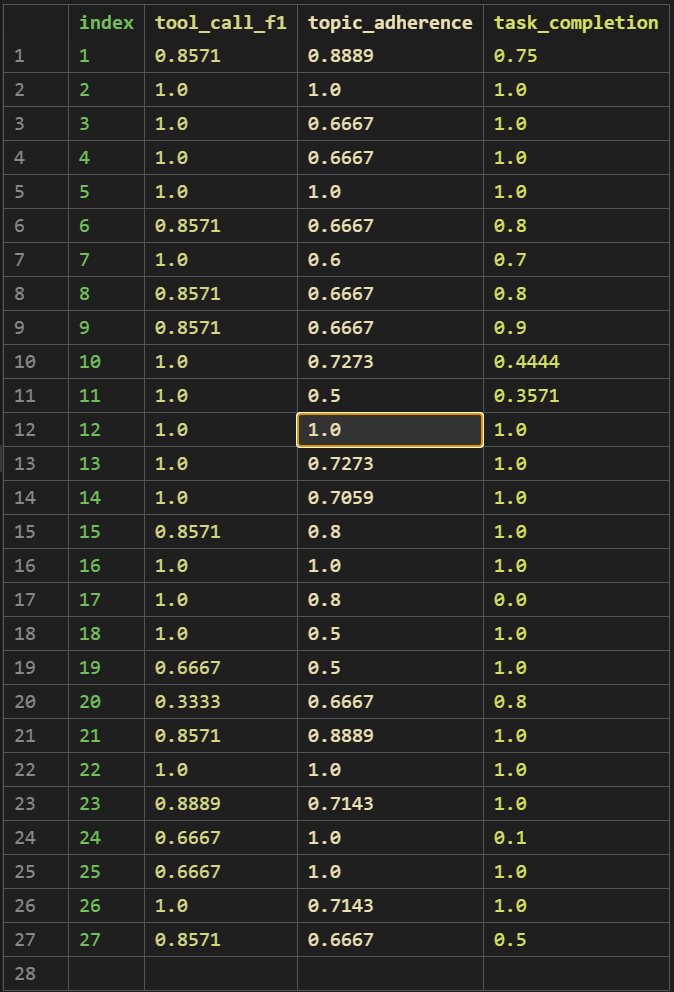

# Topic Adherence

提交代码与评估报告，评估报告内容包括但不限于：指标选取原因，指标实现过程，评估结果分析。

## 1. 指标选取原因
Topic Adherence（话题遵循度）是评估模型在生成文本时是否能够紧密围绕给定话题进行展开的指标。
该指标主要评定ai回答是否与用户提出的话题相关，是否能够准确理解并回应用户的需求。
选取该指标的原因主要在于：
- 评估模型的理解能力：Topic Adherence能够反映模型对话题的理解程度，评估其是否能够正确把握用户的意图。
- 防止大模型出现跑题现象。该指标可以将话题限制在用户提出的范围中

## 2. 指标实现过程
Topic Adherence的关键点在于topic的提取与相似性判断topic包括reference_topic及其细化，answered_topic。

- reference_topic:
一个比较笼统的reference_topic定义在metric开头
```python
DEFAULT_REFERENCE_TOPICS = ["点外卖"]  # topic_adherence
```
可以自定义修改，但是该topic显然不能作为直接的评估标准，一是因为太过宽泛，二是因为数量不足，无法进行recall等指标的运算。三是data中有expected_steps，因此可以使用expected_steps来更好的针对性的细化指标
我们调用llm来帮我们获得在这个topic问题域内的进一步细化指标(extractRequestedInDomainTopics函数)
下面是提示语
```python
        prompt = f"""
You are evaluating topic adherence for a domain-limited AI assistant.

Allowed domains:
{json.dumps(reference_topics, ensure_ascii=False)} #不转义中文字符

Task context:
{json.dumps(context, ensure_ascii=False, indent=2)} 

Extract the atomic user-requested topics that are clearly inside the allowed domains.
Use user_query as the primary source.
Use expected_steps only to clarify the intended in-domain task, not to invent unrelated topics.
Keep the output concise and domain-specific.
When the user requests a concrete domain task, break it into the important in-domain operational topics needed for that task.
For a food-delivery task, valid atomic topics can include store lookup, product lookup, place order, and payment if they are actually requested or required by expected_steps.
Do not include out-of-domain requests.
Do not include generic filler such as "help user" or "answer question".

Strictly output JSON:
{{
  "in_domain_topics": ["topic 1", "topic 2"]
}}
"""
```

- 之后是answered_topic的获取，同样调用llm对json中的steps和final_answer进行topic提取()
具体实现可见extractAnsweredTopics函数

- 评估
评估主要包括precision, recall, f1_score的计算。
计算需要的参数包括
  - TP：requested_in_domain_topics（reference_topic的细化） 中，被 steps + final_answer 覆盖的 topic 数量
    - 从verifyInDomainCoverage()获得covered_in_domain_results
  - FN：requested_in_domain_topics 中，没有被 steps + final_answer 覆盖的 topic 数量
    -  requested_in_domain_topics 总数 - TP
  - FP：answered_topics 中，属于 reference_topics 之外的 topic 数量
    - extractAnsweredOutOfDomainTopics()中筛选超出问题域的topic
上述参数的在 computeScore()中被使用，得出precision，recall，f1
最终选择f1_score作为最终的score输出
## 3. 评估结果分析

发现大部分样本维持在0.7+-0.2，说明模型能够把握住大部分话题，但是对于具体的topic细化和覆盖还有提升空间。当然也存在requested_in_domain_topics过于细化导致的分数较低的情况,可能需要进一步的修改提示词或者者调整细化的程度。