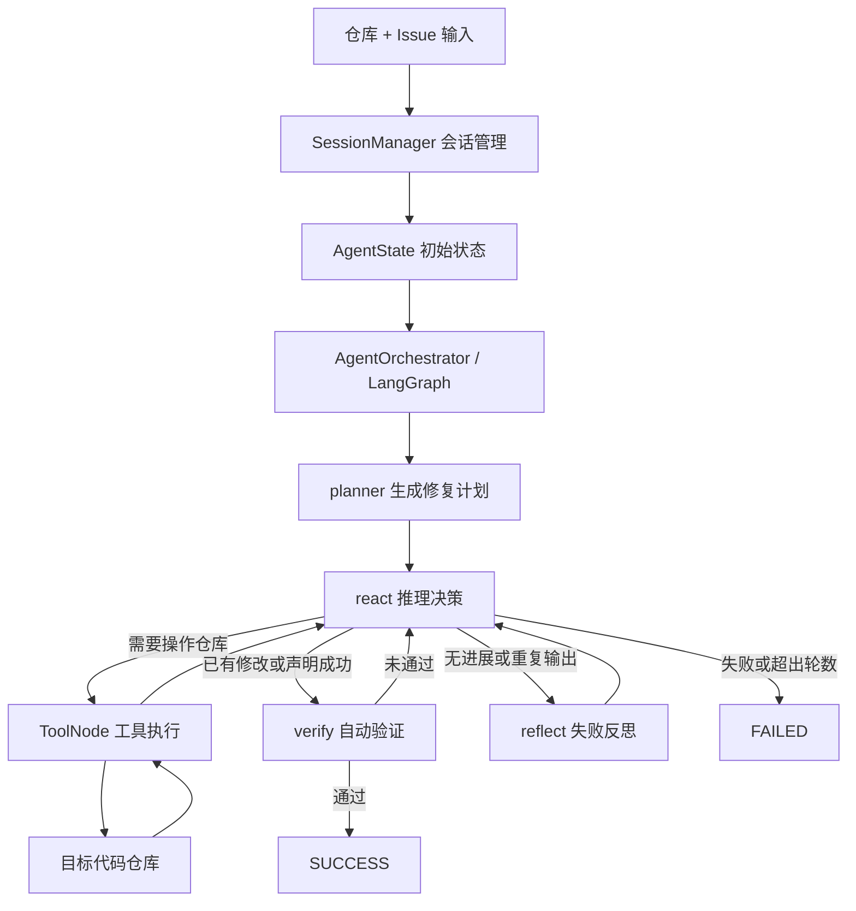

# Agent 应用核心框架介绍

## 1. 项目定位

本项目的核心是一个面向 GitHub Issue 的代码修复 Agent。用户输入目标仓库和 Issue 后，Agent 会自动完成问题理解、修复规划、代码搜索、工具调用、文件修改、测试验证、失败反思和最终状态判定。

前端与后端只作为运行与展示外壳：

- 前端：React + TypeScript + Vite。
- 后端：FastAPI + Pydantic，负责封装 Agent 运行、记录状态和返回展示数据。

真正的 Agent 框架位于 `gitIssueAssitant/` 目录。

## 2. Agent 总体框架

Agent 采用 LangGraph 构建状态图，以 `AgentState` 作为全局状态，在规划、推理、工具调用、验证和反思节点之间循环流转，直到任务成功、失败或达到最大迭代次数。

## 3. 核心模块

### 3.1 `agent.py`

`agent.py` 是大模型能力封装层，主要包含：

- `LLM_factory()`：根据环境变量创建 `ChatOpenAI` 实例。
- `Agent.generate_plan()`：根据 Issue 生成修复计划。
- `Agent.run_react()`：执行 ReAct 推理，决定是否读取文件、搜索代码、修改代码、运行测试或结束任务。
- `Agent.reflect_on_failure()`：在执行无进展时分析失败原因，并给出下一步工具策略。

该模块只负责“思考和决策”，不直接修改仓库。实际文件读写、命令执行和 Git 操作都通过工具完成。

### 3.2 `agent_state.py`

`agent_state.py` 定义了 Agent 的统一状态结构 `AgentState`，贯穿整个任务生命周期。

核心字段包括：

- `repo_path`：当前目标仓库路径。
- `issue_description`：当前 Issue 描述。
- `status`：任务状态，如 `INIT`、`PLANNING`、`RUNNING`、`REFLECTING`、`SUCCESS`、`FAILED`。
- `iteration_count` / `max_iterations`：当前轮数和最大轮数。
- `plan`：规划器生成的修复步骤。
- `messages`：LLM、用户提示和工具结果组成的消息流。
- `trajectory`：执行轨迹，包括计划、推理、工具调用、反思和验证记录。
- `reflexion_notes`：最近一次反思结果。

`messages` 和 `trajectory` 使用追加式合并，保证每一轮执行都有历史记录可追踪。

### 3.3 `orchestrator.py`

`orchestrator.py` 是 Agent 的主控模块，基于 LangGraph 编排完整修复流程。

主要节点包括：

- `planner`：调用 Agent 生成初始修复计划。
- `react`：让模型根据当前状态和工具结果进行下一步决策。
- `tools`：执行模型发起的工具调用。
- `verify`：检查是否具备成功证据。
- `reflect`：在无进展时进行失败反思。
- `finish_success`：任务成功结束。
- `finish_failed`：任务失败结束。

路由逻辑主要由 `_route_react()` 和 `_route_verify()` 控制：

- 如果模型产生工具调用，进入 `tools`。
- 如果检测到 `TASK_SUCCESS` 或已有成功修改，进入 `verify`。
- 如果没有工具调用且没有明确成功，进入 `reflect`。
- 如果超过最大迭代次数或模型声明失败，进入 `finish_failed`。

该模块还包含自动验证逻辑，不完全依赖模型自我声明成功。例如它会检查：

- 是否存在成功的 `pytest` 输出。
- 是否真的发生过文件修改。
- Issue 中提到的缺失文件是否已经存在。
- 修改文件是否与 Issue 中提到的文件匹配。
- 修改后是否出现阻塞性工具错误。

### 3.4 `tools/tools.py`

`tools.py` 是 Agent 的工具层，所有工具通过 LangChain `@tool` 暴露给模型。

工具分为几类：

- 文件操作：`read_file`、`write_file`、`replace_in_file`、`patch_file`。
- 代码搜索：`search_code`、`list_files`。
- 命令执行：`bash_terminal`、`run_pytest`。
- Git 操作：`git_clone_repo`、`git_status`、`git_diff`、`git_add`、`git_commit`、`git_push`。
- 环境辅助：`current_repo_info`。

工具层有两个关键约束：

- 所有路径都必须限制在 `GIT_ISSUE_ASSISTANT_REPO_ROOT` 内，避免越权访问。
- 工具输出会被截断，避免超长输出污染上下文。

其中 `search_code` 优先使用 `ripgrep`，不可用时降级为 Python 正则搜索；`run_pytest` 用于执行测试验证；`patch_file` 使用 `SEARCH/REPLACE` 块进行精确补丁修改。

### 3.5 `session_manager.py`

`session_manager.py` 负责仓库和任务会话管理。

主要职责包括：

- 接收本地仓库路径或 Git URL。
- 如果是远程仓库，则克隆到本地 `repos/` 目录。
- 解析 Issue 输入，支持 Issue 文本、GitHub Issue 链接或 Issue 编号。
- 通过 GitHub API 获取 Issue 标题和正文。
- 为每个仓库创建或切换对应的 `thread_id`。
- 初始化 `AgentState`，并写入 LangGraph 的 checkpoint。
- 设置 `GIT_ISSUE_ASSISTANT_REPO_ROOT`，让工具始终在当前仓库内执行。

这一层把“用户输入”转换成 Agent 可运行的标准状态。

### 3.6 `__main__.py`

`__main__.py` 提供 CLI 入口，用于本地运行和调试 Agent。

主要命令包括：

- `/repo <url|path> [dir]`：设置或切换目标仓库。
- `/issue <desc|#number|issue_url>`：设置待修复 Issue。
- `/run`：单步执行。
- `/solve [-v]`：自动执行到成功、失败或达到最大轮数。
- `/status`：查看当前状态。

CLI 成功执行后会展示 diff，并可让 Agent 生成提交文件列表和 commit message，再由用户确认是否提交和推送。

## 4. Agent 执行流程

一次完整执行大致如下：

1. 用户指定仓库和 Issue。
2. `SessionManager` 准备仓库、解析 Issue、初始化 `AgentState`。
3. `AgentOrchestrator` 进入 `planner` 节点，生成初始计划。
4. 进入 `react` 节点，模型基于当前状态决定下一步。
5. 如果需要证据或修改，模型调用工具，例如搜索代码、读取文件、打补丁或运行测试。
6. 工具结果返回后，继续进入 `react`。
7. 如果出现无进展、重复输出或无法推进，进入 `reflect` 生成反思，再回到 `react`。
8. 如果完成修改或模型声明成功，进入 `verify` 自动验证。
9. 验证通过则进入 `SUCCESS`，否则继续修复。
10. 超过最大轮数或明确失败则进入 `FAILED`。

## 5. Agent 的闭环能力

该 Agent 不是一次性问答式结构，而是一个带状态的自动修复闭环：

- 规划：先把 Issue 拆成排查和修复步骤。
- 观察：通过工具读取仓库、搜索代码、查看 diff 和运行测试。
- 行动：使用文件修改工具直接改代码。
- 验证：结合测试结果、文件修改和 Issue 要求进行自动判定。
- 反思：当无进展时总结失败原因并调整策略。
- 终止：根据成功证据、失败信号和最大轮数决定是否结束。

## 6. 运行时依赖

Agent 核心依赖：

- Python 3.11+
- LangChain
- LangGraph
- langchain-openai
- python-dotenv
- Git
- pytest
- ripgrep，可选但推荐

关键环境变量：

- `OPENAI_API_KEY`：模型调用密钥。
- `OPENAI_BASE_URL`：兼容 OpenAI 接口的网关地址，可选。
- `MODEL_NAME`：模型名称。
- `GIT_ISSUE_ASSISTANT_HOME`：Agent 工作根目录。
- `GIT_ISSUE_ASSISTANT_REPO_ROOT`：当前目标仓库根目录。
- `GITHUB_TOKEN`：访问 GitHub Issue API 时可选，用于私有仓库或提高限额。

## 7. 当前架构特点

当前 Agent 框架的主要特点是：

- 使用 LangGraph 显式管理状态流转。
- 使用 `AgentState` 保存完整执行上下文。
- 使用 LangChain tool calling 统一工具调用方式。
- 通过 `SessionManager` 支持多仓库、多 Issue 会话。
- 通过 `verify` 节点增加自动成功判定，避免只依赖模型口头声明。
- 通过 `reflect` 节点处理无进展情况，增强自我修正能力。

当前限制：

- 工具执行依赖全局工作目录和环境变量，不适合并发运行多个修复任务。
- 任务状态默认存在内存 checkpoint 中，持久化能力有限。
- 自动验证主要依赖 pytest 输出、diff 和启发式规则。
- Docker 隔离和更严格的执行沙箱仍属于后续优化方向。
